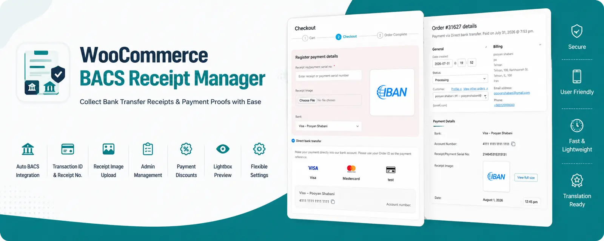

<p align="center">

<!-- Banner -->



</p>

# WooCommerce BACS Receipt Manager

Automatically collect bank transfer receipts, transaction IDs, and payment proofs for WooCommerce BACS payments.

This plugin extends the default WooCommerce Direct Bank Transfer (BACS) gateway by allowing customers to submit payment details and upload receipt images. Administrators can review, manage, and verify submitted receipts directly from the WooCommerce order page.

---
# 🚀 Live Demo

👉 [https://dev.pooyan-shabani.ir/shop/decoration-wooden-present/](https://dev.pooyan-shabani.ir/shop/decoration-wooden-present/?add-to-cart=334&quantity=1)


## ✨ Features

- Automatically detects configured WooCommerce BACS bank accounts
- Displays bank accounts with logos
- Click-to-copy account/card numbers
- Upload payment receipt images
- Transaction ID / Receipt Number field
- Store payment details inside WooCommerce Orders
- Dedicated Order Meta Box
- Replace or delete uploaded receipts
- Lightbox preview for uploaded images
- Display payment form on Checkout page or Thank You page
- Optional discount for BACS payments
- Percentage or Fixed discount
- Hide other payment gateways above a configurable order amount
- Translation Ready
- Fully responsive
- Lightweight implementation

---

# 📸 Screenshots

## Plugin Settings

<!-- Screenshot -->

images/settings.png

---

## Checkout Page

<!-- Screenshot -->

images/checkout.png

---

## Thank You Page

<!-- Screenshot -->

images/thankyou.png

---

## WooCommerce Order Admin

<!-- Screenshot -->

images/order-admin.png

---

# 🎥 Demo

### Checkout Flow

GIF or MP4

demo/checkout.gif

---

### Admin Order Management

GIF or MP4

demo/order-admin.gif

---

# ⚙️ How It Works

1. Customer selects **Direct Bank Transfer (BACS)**

2. Plugin automatically loads all configured bank accounts.

3. Customer selects the desired account.

4. Customer enters:

- Transaction ID
- Receipt Number
- Receipt Image (optional)

5. Order is submitted.

6. Payment information is stored inside WooCommerce.

7. Administrator reviews the receipt directly from the order page.

---

# 🧩 Plugin Highlights

✔ Automatic WooCommerce BACS integration

✔ No duplicate bank account configuration

✔ Responsive checkout interface

✔ Image upload support

✔ Receipt management

✔ Optional payment discounts

✔ Checkout or Thank You submission

✔ Translation Ready

---

# 📁 Repository Structure

```
advanced-bank-transfer-manager/

│

├── assets/

├── languages/

├── includes/

├── images/

├── demo/

├── woocommerce-bacs-receipt-manager.php

└── README.md
```

---

# 🚀 Installation

1. Download the latest release.

2. Upload the plugin to WordPress.

3. Activate it.

4. Configure WooCommerce → Settings → Payments → BACS Receipt Manager.

---

# Requirements

- WordPress 6+

- WooCommerce 8+

- PHP 7.4+

---

# Roadmap

## Version 1.1

- Order List receipt status column
- Receipt verification status
- Pending / Verified / Rejected badges

---

## Version 1.2

- Email notification after receipt upload
- Customer upload history
- Receipt expiration reminder

---

## Version 1.3

- Multiple receipt uploads
- PDF receipt support
- Drag & Drop upload

---

## Version 2.0

- Partial payment support
- Multi-bank grouping
- Receipt analytics dashboard
- Export payment reports

---

# Contributing

Pull Requests are welcome.

For major changes, please open an Issue first.

---

# License

GPL-2.0

---

⭐ If you find this project useful, consider giving it a Star.
